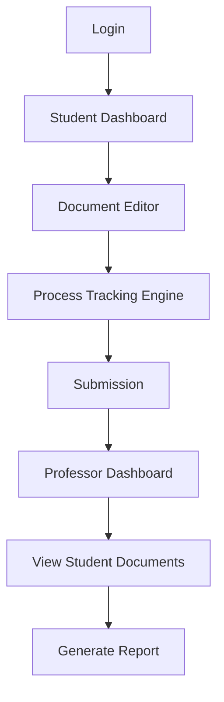

# WordTrace

**WordTrace** is a process-based authorship transparency platform designed to restore trust in academic writing in the age of AI.

Traditional AI detection tools analyze only the final output and often produce false positives, leading to unfair accusations and academic stress. WordTrace shifts the focus from output to process verification by tracking how a document is written — not just what is submitted. By logging real-time writing behavior, detecting paste events, capturing document snapshots, and generating authorship confidence scores, WordTrace provides educators with contextual transparency instead of black-box suspicion.

##  Features

1. **Real-Time Writing Log**
* Tracks insert, delete, and paste events.
* Records timestamped writing behavior.
* Builds complete writing history.


2. **Paste Detection + Explanation Prompt**
* Detects large paste blocks.
* Prompts student to declare: Source, Reason, and AI usage.
* Stores transparency metadata.


3. **Timeline Replay**
* Captures periodic document snapshots.
* Interactive slider to replay writing evolution.
* Visual proof of progressive development.


4. **Authorship Confidence Meter**
* Heuristic scoring based on: Writing activity depth, Revision patterns, Paste dependency, and Behavioral consistency.


5. **AI Transparency Log**
* Display Paste events.
* Display Declared AI usage.
* Display Source explanations.


6. **Integrity Badge System**
7. **Professor Dashboard**
* View submissions.
* See authorship score.
* Replay writing timeline.
* Review transparency logs.


##  Tech Stack

### Frontend

* **React (Vite)** – UI framework
* **Tailwind CSS** – Styling
* **React Router DOM** – Routing & navigation

### State & Data Handling

* **React Hooks (useState, useEffect)** – State management
* **LocalStorage API** – Client-side persistence
* **UUID** – Unique event tracking


##  Architectural Diagram




##  Installation & Run Commands

### Installation

```bash
git clone https://github.com/Navaneetha-Rajesh/WordTrace.git
cd WordTrace
npm install

```

### Run

```bash
npm run dev

```


##  Media

* **Screenshots:** [Insert Screenshots Here]
* **Demo Video Link:** [Insert Demo Video Link Here]


##  Team Members

* Navaneetha Rajesh
* Eza Mariyam Robin


##  License Info

Distributed under the **MIT License**.
© 2026 Navaneetha Rajesh, Eza Mariyam Robin.

